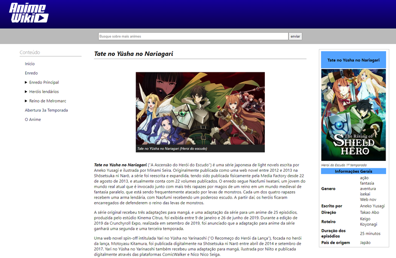

# Módulo 3 - Trilha HTML

**Título:** Recriando Wikipedia, com um layout melhor :)

 

## Objetivo
Este desafio consiste em treinar você com relação a estrutura do site, e também aplicar conhecimentos adiquiridos sobre semântica e acessibilidade.

